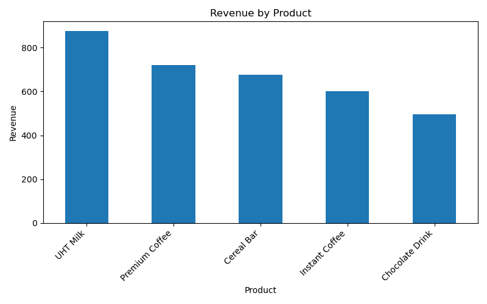
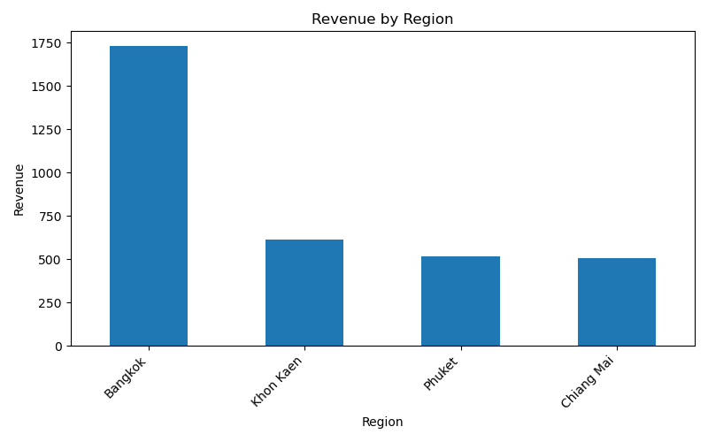
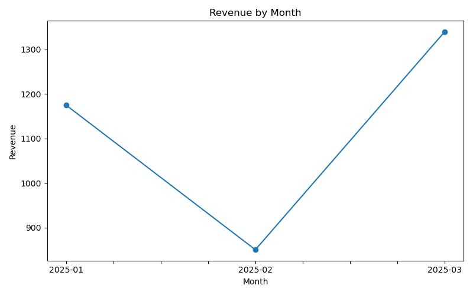

# FMCG Sales Analytics Project

## Project Overview
This project analyzes FMCG sales data to identify product performance, 
regional trends, and the impact of promotions. The goal is to transform 
raw sales data into actionable business insights.

## Project Structure
fmcg-sales-analytics/
│
├── data/ # raw dataset
├── notebooks/ # analysis code
├── dashboard/ # charts
├── reports/ # business report
└── README.md

## How to Run
```bash
pip install pandas matplotlib
python notebooks/sales_analysis.py

## Dataset
The dataset contains sales transactions including:
- Product category and product name
- Region (Bangkok, Chiang Mai, etc.)
- Unit price and quantity
- Promotion status
- Customer type

## Tools Used
- Python
- Pandas
- SQL (concept)
- Data Analysis

## Key Analysis

### Total Revenue
Total revenue generated: **3,365**

### Revenue by Product
- UHT Milk: 875
- Premium Coffee: 720
- Cereal Bar: 675
- Instant Coffee: 600
- Chocolate Drink: 495

### Revenue by Region
- Bangkok: 1,730
- Khon Kaen: 615
- Phuket: 515
- Chiang Mai: 505

### Revenue by Month
- January 2025: 1,175
- February 2025: 850
- March 2025: 1,340

### Promotion Impact
- With Promotion: 2,245
- Without Promotion: 1,120

## Business Insights

1. UHT Milk is the top-performing product and contributes the highest 
revenue.
2. Bangkok is the strongest market with the highest sales performance.
3. Promotions significantly increase revenue and should be further 
optimized.
4. Sales trend shows growth in March, indicating potential seasonal 
demand.

## Business Recommendations

- Increase marketing budget for top-performing products such as UHT Milk.
- Focus sales campaigns in Bangkok to maximize ROI.
- Expand promotion strategies to boost overall revenue.
- Investigate seasonal trends for better inventory planning.

## Conclusion
This project demonstrates how data analysis can be used to support 
business decision-making in FMCG industries.

## Dashboard Preview

### Revenue by Product


### Revenue by Region


### Revenue by Month


## Customer Segmentation (RFM Analysis)

This project also includes customer segmentation using RFM (Recency, 
Frequency, Monetary) analysis.

### Key Findings

- **VIP Customers** generate the highest revenue and have recent 
purchases. These customers should be prioritized for retention strategies.
- **Loyal Customers** are still active and should be encouraged with 
loyalty programs.
- **At Risk Customers** have not purchased recently and may churn if not 
re-engaged.

### Business Recommendations

- Provide exclusive promotions or rewards for VIP customers.
- Create loyalty campaigns to retain active customers.
- Launch re-engagement campaigns (discounts, reminders) for at-risk 
customers.

## Mini Data Pipeline Project

This project includes a mini data pipeline designed to simulate a 
real-world data workflow.

### Pipeline Flow

```text
CSV Data Source
      ↓
Python Extract
      ↓
Data Transformation
      ↓
SQLite Database
      ↓
Summary Report
